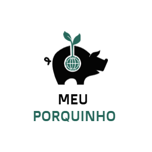

# Projeto: App Meu Porquinho

O **App Meu Porquinho** é uma aplicação web desenvolvida em Laravel, destinada a auxiliar os usuários no gerenciamento de suas finanças pessoais. Através de uma interface intuitiva, o aplicativo permite que os usuários realizem operações de entrada e saída de dinheiro, categorizando suas transações para facilitar o acompanhamento dos gastos e receitas.

## Funcionalidades Principais

1. **Cadastro de Transações**: Os usuários podem registrar entradas e saídas de dinheiro, especificando valores, descrições e categorias associadas a cada transação.

2. **Visualização de Saldo**: Os usuários têm acesso ao saldo atual da sua "carteira", que é atualizado automaticamente conforme as transações são registradas ou removidas.

3. **Dashboard Interativo**: O aplicativo possui um painel que apresenta gráficos em pizza, mostrando a distribuição de gastos e receitas por categoria, além de permitir a seleção de períodos para análise das finanças.

4. **Edição e Exclusão de Transações**: Os usuários podem editar ou excluir transações, com a lógica de ajuste automático no saldo da carteira.

5. **Interface Responsiva**: A aplicação é projetada para ser responsiva, garantindo uma boa experiência de uso tanto em dispositivos móveis quanto em desktops.

6. **Autenticação**: A aplicação oferece um sistema de autenticação de usuários, garantindo que as informações financeiras sejam seguras e acessíveis apenas para cada usuário.

O **App Meu Porquinho** se destaca como uma ferramenta prática e eficiente para quem busca organizar suas finanças de forma simples e visual.

Caso você encontre algum bug e deseje reporta-lo, pode me mandar uma mensagem no instagram :) https://www.instagram.com/joaovictor.doratioto/ 
